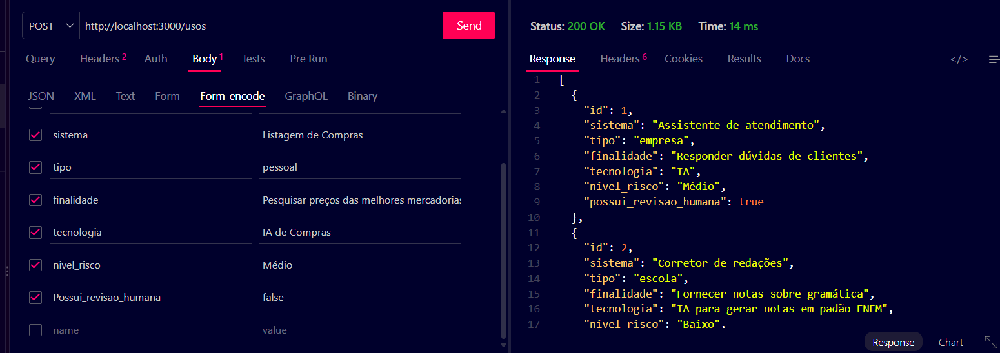
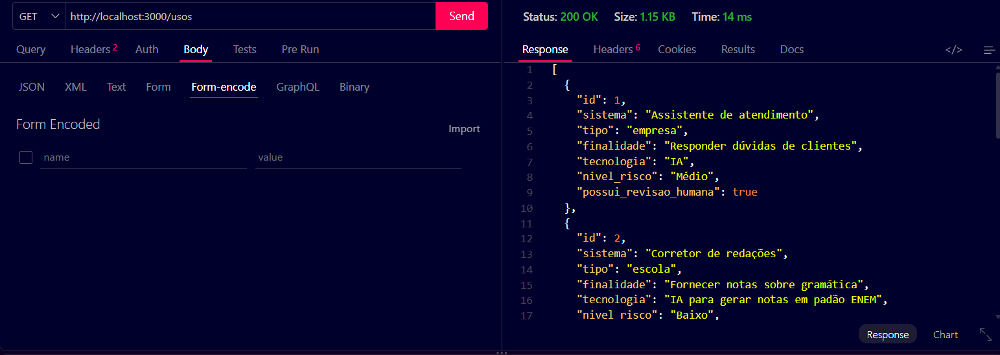
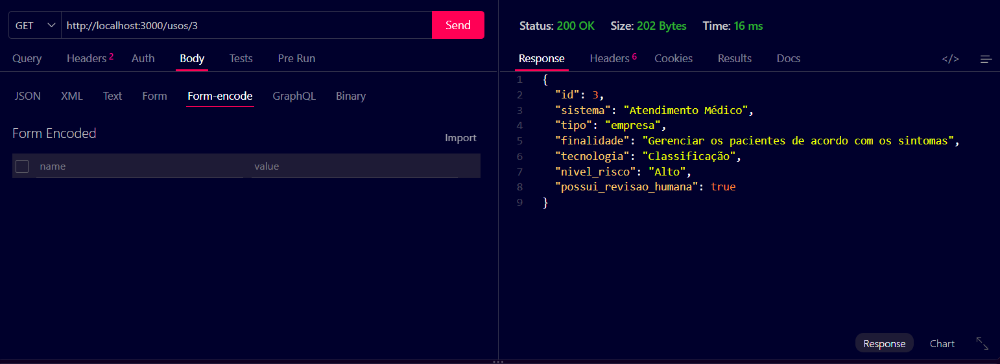

# Banco de Usos de Inteligência Artificial

Projeto desenvolvido para cadastrar e gerenciar diferentes usos de Inteligência Artificial por empresas, escolas e pessoas, identificando suas finalidades e níveis de risco.

---
# Tecnologias Utilizadas

- **Node.js**
- **JavaScript**
- **HTML**
- **VsCode**
- **VsCode** Thunder Client

---
# Passos para Testar

1. Clone este repositório
2. Abra com VsCode e em um terminal digite:
   ```bash
   npm install

3. Teste as rotas com a extensão ```Thunder Client do VsCode
4. Abra o arquivo ```client/index.html com a extensão Live Server do VsCode
---

# Print dos testes e exemplo de requisições

- **CREATE**


- **READ ALL**


- **BUSCAR**

---

# Cliente 


